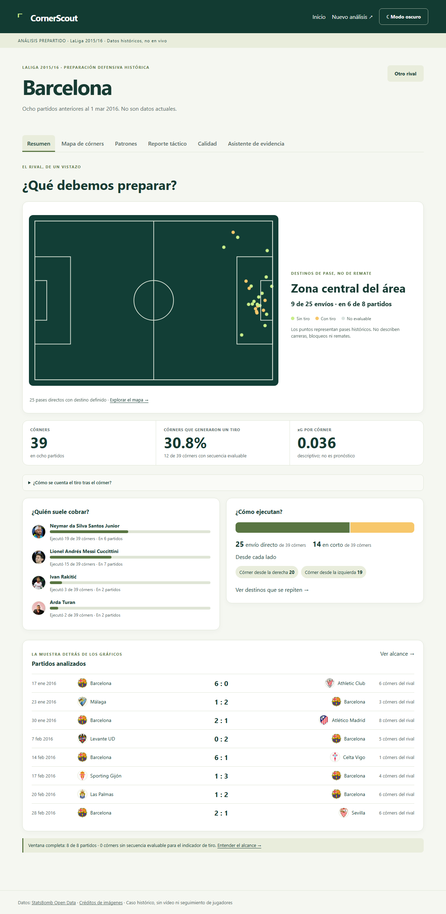
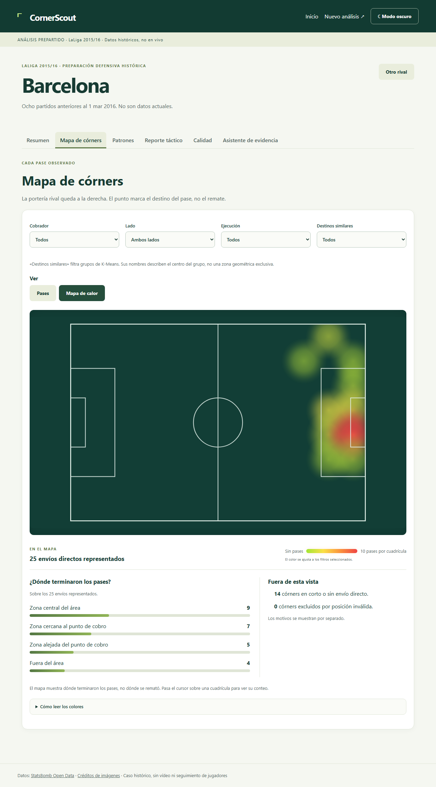
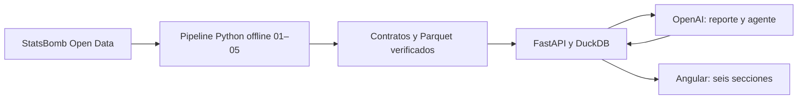

# CornerScout ⚽

**Del córner observado a una preparación táctica con evidencia.** MVP académico
del Diplomado en Ciencia de Datos: analiza los ocho partidos anteriores de un
rival, muestra sus ejecuciones y destinos, y permite consultar un asistente.

> Caso histórico: **LaLiga 2015/16**, StatsBomb Open Data. No son datos actuales
> ni una garantía de resultados deportivos. Publicación externa pendiente.

[Instalar y ejecutar](#1-instalar-las-herramientas) ·
[Datos](docs/data-restoration.md) · [Arquitectura](docs/architecture.md) ·
[Validación](docs/validation.md) · [Despliegue pendiente](docs/deployment.md)

## Una mirada a la aplicación





Las capturas se obtienen del recorrido E2E local. Los puntos muestran destinos
del pase; las cifras pertenecen a la ventana seleccionada de 2015/16.

## Qué incluye

- Seis secciones: Resumen, Mapa, Patrones, Reporte, Calidad y Asistente.
- 380 partidos, 1.295.354 eventos y 3.841 córners; 3.835 evaluables y seis
  excluidos por reloj ambiguo. 1.245 secuencias evaluables tienen tiro.
- FastAPI con contratos verificados y Angular standalone con cliente OpenAPI.
- 20 escudos y 202 retratos de cobradores incluidos, sin descargarlos al compilar.
- OpenAI exclusivamente en el backend, con respuesta determinista de respaldo.

## Arquitectura



Los datos se descargan y los modelos se entrenan **antes de arrancar la app**.
Una solicitud web no descarga StatsBomb ni entrena. DuckDB consulta tablas
controladas; el agente no genera SQL.

## 1. Instalar las herramientas

Necesitas Git, Python **3.11 o superior**, uv y Node **24.15 o superior dentro
de la versión 24** (incluye npm). Docker Desktop es opcional para la ruta Docker.

Descargas: [Git](https://git-scm.com/downloads),
[Python](https://www.python.org/downloads/),
[uv](https://docs.astral.sh/uv/getting-started/installation/),
[Node](https://nodejs.org/en/download),
[Docker Desktop](https://www.docker.com/products/docker-desktop/).

En Windows instala Git y Python desde sus instaladores oficiales; para Python,
habilita la opción de añadirlo a PATH. Instala Node 24 con npm. Para uv, abre
PowerShell y usa el comando oficial:

```powershell
powershell -ExecutionPolicy ByPass -c "irm https://astral.sh/uv/install.ps1 | iex"
```

Este comando descarga y ejecuta el instalador de uv. Abre una terminal nueva
al terminar. Docker Desktop solo es necesario si vas a seguir la ruta Docker;
inícialo y espera a que el motor esté disponible antes de usar `docker compose`.

En una terminal PowerShell verifica:

```powershell
git --version
python --version
uv --version
node --version
npm --version
```

Si una herramienta no se reconoce, termina su instalación y abre una terminal
nueva. Los comandos siguientes se ejecutan desde la raíz del proyecto.

## 2. Obtener e instalar CornerScout

```powershell
git clone https://github.com/ElRubsSan/Corner_Scout.git
Set-Location Corner_Scout
```

Abre la carpeta descargada en tu editor y una terminal dentro de ella. Debes
ver `pyproject.toml`, `uv.lock`, `backend/` y `frontend/`.

```powershell
uv sync --locked --all-extras
npm --prefix frontend ci
```

uv crea `.venv` y npm instala exactamente el lockfile del frontend. No necesitas
activar manualmente el entorno cuando usas `uv run`.

Para macOS/Linux, instala las mismas herramientas con sus guías oficiales.
Los comandos `uv` y `npm --prefix` son los mismos; entra con `cd Corner_Scout`
y usa `export NOMBRE=valor` en lugar de `$env:NOMBRE = "valor"`.

## 3. Preparar datos y modelos (una sola vez)

Los datos pesados **no están en Git**. Una clonación recién instalada necesita
descargarlos o restaurarlos; copiar solo el código no basta para arrancar la API.

### Opción A: construir desde StatsBomb

```powershell
uv run cornerscout ingest
uv run --all-extras cornerscout build
uv run --all-extras cornerscout train
```

La primera ejecución requiere Internet, espacio y tiempo: procesa más de un
millón de eventos. No se fija una duración universal. La descarga usa una
revisión concreta del proveedor y reanuda archivos faltantes sin sobrescribir
raw. `build` ejecuta limpieza, SCR-15 y variables; `train` publica modelado.

### Opción B: restaurar una copia completa

Sigue [restauración de datos](docs/data-restoration.md). Debes conservar los
contratos y **todos** los archivos declarados de `interim/02_clean`,
`interim/03_scr15`, `processed/04_features` y `processed/05_modeling`.
No sustituirlos por Parquet antiguos con nombres parecidos. Para usar otro
directorio padre de `raw/`, `interim/` y `processed/`:

```powershell
$env:CORNERSCOUT_DATA_DIR = "D:\CornerScout-data"
```

## 4. Configurar OpenAI (opcional)

Copia `.env.example` a `.env` desde el editor y completa únicamente en ese archivo:

```dotenv
OPENAI_API_KEY=tu_clave
OPENAI_MODEL=tu_modelo_disponible
CORNERSCOUT_ORIGINS=http://localhost:4200,http://127.0.0.1:4200
```

También puedes copiarlo desde PowerShell **si todavía no existe `.env`**:

```powershell
Copy-Item .env.example .env
```

No publiques `.env`. El modelo debe estar disponible para tu cuenta. El notebook
académico ejecutado utilizó Terra con éxito; eso no demuestra que cualquier
cuenta tenga acceso al mismo identificador. La app usa su configuración backend.
Sin clave, reporte y agente funcionan con respaldo determinista visible.

El comando de arranque de abajo carga `.env` explícitamente. Si no deseas OpenAI,
puedes dejar `OPENAI_API_KEY` vacío. Reinicia el backend al cambiar el archivo.

## 5. Arrancar la aplicación: dos terminales

**Terminal 1 — backend**, desde la raíz:

```powershell
uv run --all-extras uvicorn backend.main:app --env-file .env --host 127.0.0.1 --port 8000
```

Si no creaste `.env`, omite `--env-file .env`.

**Terminal 2 — frontend**, también desde la raíz:

```powershell
npm --prefix frontend start
```

- Aplicación: http://127.0.0.1:4200
- Swagger: http://127.0.0.1:8000/docs
- Proceso activo: http://127.0.0.1:8000/api/v1/health
- Datos preparados: http://127.0.0.1:8000/api/v1/ready

El frontend local utiliza el proxy hacia el backend. Detén cada servicio con
Ctrl+C en su terminal. No hace falta abrir ni ejecutar notebooks para usarlo.

## 6. Primer análisis

1. Abre «Nuevo análisis» y selecciona Barcelona como rival.
2. Elige «Hasta una fecha histórica» y establece `2016-03-01`.
3. Consulta y confirma los ocho partidos anteriores; el día de corte no entra.
4. Crea el análisis. Recorre Resumen, Mapa, Patrones y Calidad.
5. En Reporte solicita una lectura; en Asistente pregunta qué partidos se
   analizaron o cuántos córners evaluables terminaron en tiro.

Las listas se leen cronológicamente. Un destino visual representa un pase,
no un remate. Calidad explica qué modelo fue seleccionado y los límites.

## 7. Verificar una instalación

```powershell
uv run --all-extras python -m pytest -q
uv run --extra api python scripts/check_visual_coverage.py --require-complete
npm --prefix frontend run typecheck
npm --prefix frontend run build
npm --prefix frontend exec playwright install chromium
npm --prefix frontend run e2e
```

E2E arranca sus propios servicios en puertos 8001 y 4201. Requiere datos
canónicos, Node y Chromium. El registro de comandos, resultados y omisiones
está en [validación local](docs/validation.md).

## Docker

Con Docker Desktop iniciado y los datos preparados:

```powershell
docker compose build backend
docker compose up -d backend
uv run --extra api python scripts/smoke_deployment.py --base-url http://127.0.0.1:8000
docker compose down
```

Docker publica el mismo puerto 8000: no arranques simultáneamente el backend
local. Solo `processed/runs` tiene escritura persistente; las cuatro etapas
canónicas se montan en lectura. [Detalles y pruebas reales](docs/deployment.md).

## Solución de problemas

| Problema | Qué comprobar |
|---|---|
| `/health` funciona pero `/ready` devuelve 503 | Restaurar o construir todos los contratos y artefactos canónicos. |
| No se puede crear análisis | Elegir una fecha con ocho partidos anteriores disponibles. |
| Interfaz no conecta | Mantener ambas terminales activas; backend 8000 y proxy local. |
| Aparece respuesta determinista | Clave ausente, proveedor no disponible o respuesta rechazada; no implica datos inventados. |
| Error al cargar `.env` | Instalar `uv sync --locked --all-extras` y comprobar que el archivo existe. |
| Error de hash o linaje | No editar artefactos; restaurar el conjunto coherente o reconstruir las etapas. |
| Build Vercel rechaza URL ausente | Configurar `CORNERSCOUT_API_BASE_URL` al desplegar; ver guía. |

## Estructura y documentación

```text
analytics/     ingesta, limpieza, variables, modelado y herramientas científicas
backend/       FastAPI, acceso verificado, reporte y agente
frontend/      Angular y recursos visuales estáticos
contracts/     contrato OpenAPI versionado
tests/         pruebas del pipeline y backend
scripts/       inventario visual, codegen y smoke de despliegue
docs/          método, modelos, datos y operación
data/          datos locales fuera de Git
```

[Arquitectura](docs/architecture.md) · [SCR-15](docs/scr15-methodology.md) ·
[Modelos](docs/model-card.md) · [OpenAI](docs/openai.md) ·
[Datos](docs/data-restoration.md) · [Imágenes](docs/visual-assets.md) ·
[Índice completo de guías](docs/README.md)

La entrega científica se conserva aparte en `artifacts/entrega-academica.zip`
local, fuera de Git; contiene el notebook ejecutado comentado y las fuentes.
Los notebooks se retiraron del repositorio de producto después de verificar
esa copia. No son una dependencia de instalación ni ejecución. Ver
[entrega académica](docs/academic-report.md).

## Despliegue: pendiente

La ruta preparada para alojamiento gratuito es **Vercel Services con Angular
y FastAPI en el mismo dominio**. Seguir [Vercel paso a paso](docs/vercel.md):
incluye ZIP canónico fuera de Git, build verificado y sesiones firmadas sin
disco persistente. La publicación y el tamaño final del bundle aún requieren
verificación en Vercel. OpenAI usa la clave del propietario y tiene consumo
facturado independiente del alojamiento.

El backend Docker y OpenAI se probaron localmente. **No hay despliegue público
validado**. La ruta Services empaqueta los artefactos y usa contexto firmado
para evitar depender de escritura persistente. La alternativa de frontend
separado requiere backend público, URL y CORS. Vercel y las pruebas HTTPS
públicas quedan pendientes. [Guía de despliegue](docs/deployment.md).

Fuente: [StatsBomb Open Data](https://github.com/statsbomb/open-data), revisión
`4b73468fc5b0f1950f9f66fada70ad3a4f9327cb`.

Créditos de imágenes: [fuentes y cobertura](docs/visual-assets.md) y la página
«Créditos de imágenes» de la aplicación. La organización de las instrucciones
toma como referencia [Inver-AI del profesor](https://github.com/FernandoBRdgz/inverai-claude).
