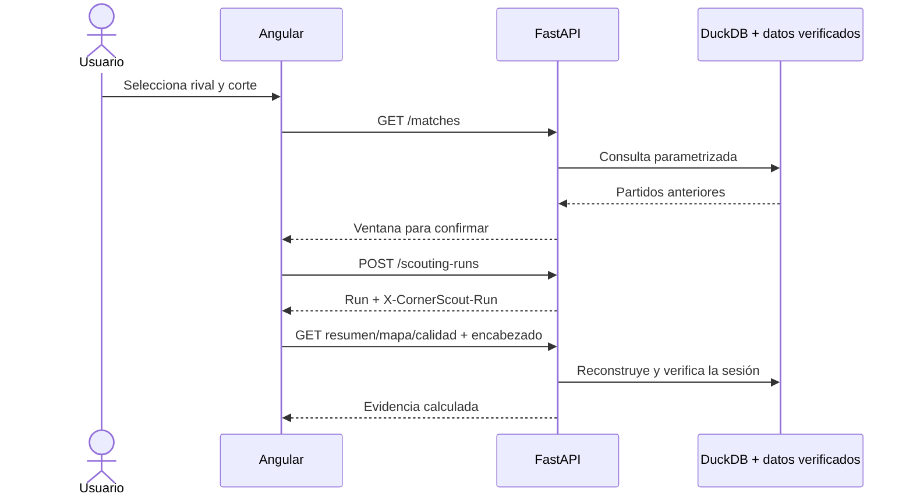
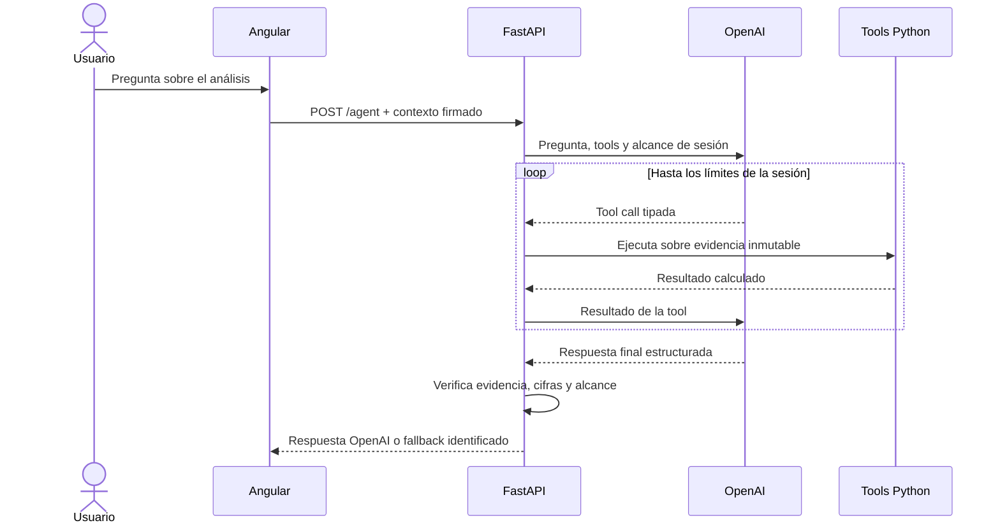

# Backend · FastAPI

La API sirve evidencia histórica de LaLiga 2015/16 con consultas DuckDB
controladas, contratos Pydantic y OpenAI opcional. No descarga StatsBomb ni
entrena por solicitud. La instalación completa comienza en el
[README principal](../README.md).

## Instalar y arrancar

Desde la raíz del repositorio, con Python y uv instalados:

```powershell
uv sync --locked --all-extras
```

Prepara o restaura las cuatro etapas `02`–`05` según
[la guía de datos](../docs/data-restoration.md). Copia `.env.example` a `.env`
desde el editor. La clave puede quedar vacía para usar respaldo determinista.

```powershell
uv run --all-extras uvicorn backend.main:app --env-file .env --host 127.0.0.1 --port 8000
```

Si no creaste `.env`, omite `--env-file .env`. Detén el servicio con Ctrl+C.
Reinícialo tras cambiar variables o artefactos. Para desarrollo con recarga,
añade `--reload --reload-dir backend --reload-dir analytics`; así no vigila
los datos ni el entorno virtual.

## Comprobar que está disponible

- http://127.0.0.1:8000/api/v1/health: proceso activo (`status: ok`).
- http://127.0.0.1:8000/api/v1/ready: contratos, hashes y lectura canónica
  disponibles (`status: ready`).
- http://127.0.0.1:8000/docs: Swagger, esquemas y pruebas HTTP interactivas.
- http://127.0.0.1:8000/openapi.json: contrato HTTP generado por FastAPI.

Un health correcto no garantiza que los datos estén listos. Si ready devuelve
503, consulta el error de la terminal y restaura o construye el conjunto entero.

## Comportamiento de la API

Todas las rutas de producto empiezan por `/api/v1`:

| Método y ruta | Entrada principal | Resultado y uso |
|---|---|---|
| `GET /health` | Ninguna | Confirma que el proceso FastAPI responde. |
| `GET /ready` | Ninguna | Verifica contratos, hashes, linaje y lectura de datos canónicos. |
| `GET /teams` | Ninguna | Equipos disponibles para «Nuevo análisis». |
| `GET /matches` | `rival`, `before`, `limit` | Partidos históricos elegibles para confirmar la ventana. |
| `POST /scouting-runs` | Rival y fecha de corte o partido objetivo | Fija exactamente ocho partidos anteriores y devuelve el análisis. |
| `GET /scouting-runs/{run_id}` | ID y contexto de sesión | Reconstruye y valida el análisis activo. |
| `GET .../matches-profile` | Análisis activo | Lectura cronológica partido por partido. |
| `GET .../summary`, `GET .../habits` | Análisis activo | Indicadores y perfil descriptivo de córners. |
| `GET .../corners` | Filtros de cobrador, lado, ejecución y cluster | Pases observados para el mapa. |
| `GET .../destination-heatmap` | Los mismos filtros espaciales | Conteos por cuadrícula y exclusiones del mapa de calor. |
| `GET .../patterns` | Análisis activo | Grupos descriptivos de destinos directos. |
| `GET .../quality`, `GET .../model` | Análisis activo | Cobertura, reglas y decisiones de evaluación temporal. |
| `GET .../report-plan`, `POST .../report` | Análisis activo | Plan transparente y reporte estructurado. |
| `POST .../agent` | `question` | Respuesta acotada a la evidencia de la sesión. |

Usa Swagger para el cuerpo exacto y los esquemas. En local los runs se escriben
en `processed/runs`. En Vercel, `POST /scouting-runs` devuelve además
`X-CornerScout-Run`: Angular guarda el valor en `sessionStorage` y lo reenvía en
cada ruta del análisis. La firma bloquea rival, corte, ID y fingerprint; no
contiene claves y un cambio canónico invalida sesiones incompatibles.



## Herramientas del asistente

El modelo solo puede solicitar tres herramientas tipadas y de solo lectura:

| Tool | Argumentos | Devuelve |
|---|---|---|
| `obtener_historial` | Rival y fecha, validados contra la sesión | IDs y cantidad de los ocho partidos anteriores. |
| `obtener_perfil_corners` | Rival y fecha, validados contra la sesión | Indicadores calculados, cobertura y referencias históricas. |
| `consultar_evidencia` | Uno a doce `evidence_ids` existentes | El detalle exacto de las evidencias solicitadas. |

El registro no incluye web, escritura, SQL libre, entrenamiento ni acceso a
otros análisis. Python fija la evidencia y valida citas y cifras; el modelo
redacta. Hay límites de cuatro tools, cuatro turnos reales, 45 segundos y
12.000 tokens por sesión. Una reparación final no puede ejecutar nuevas tools;
si también falla, se devuelve el respaldo determinista.



## Configuración

| Variable | Uso |
|---|---|
| `CORNERSCOUT_DATA_DIR` | Padre de `raw`, `interim` y `processed`; por defecto `data`. |
| `CORNERSCOUT_ORIGINS` | Orígenes CORS separados por comas, sin rutas. |
| `CORNERSCOUT_STATELESS_RUNS` | Usa contexto firmado en vez de archivos de run. |
| `CORNERSCOUT_SESSION_SECRET` | Firma sesiones stateless; mínimo 32 caracteres. |
| `OPENAI_API_KEY` | Clave opcional, exclusivamente backend. |
| `OPENAI_MODEL` | Modelo disponible con salida estructurada; ejemplo `gpt-4.1-mini`. |

El reporte y agente identifican OpenAI o fallback. El agente registra solo
`obtener_historial`, `obtener_perfil_corners` y `consultar_evidencia`, con rival
y corte bloqueados. Ver [OpenAI](../docs/openai.md).

## Verificar y mantener

```powershell
uv run --all-extras pytest
uv run --extra api python scripts/export_openapi.py
```

Para completar la regeneración del cliente, seguir
[contratos](../contracts/README.md). Docker y los montajes se explican en
[despliegue](../docs/deployment.md). La aplicación pública está en
[cornerscout-ten.vercel.app](https://cornerscout-ten.vercel.app/).
