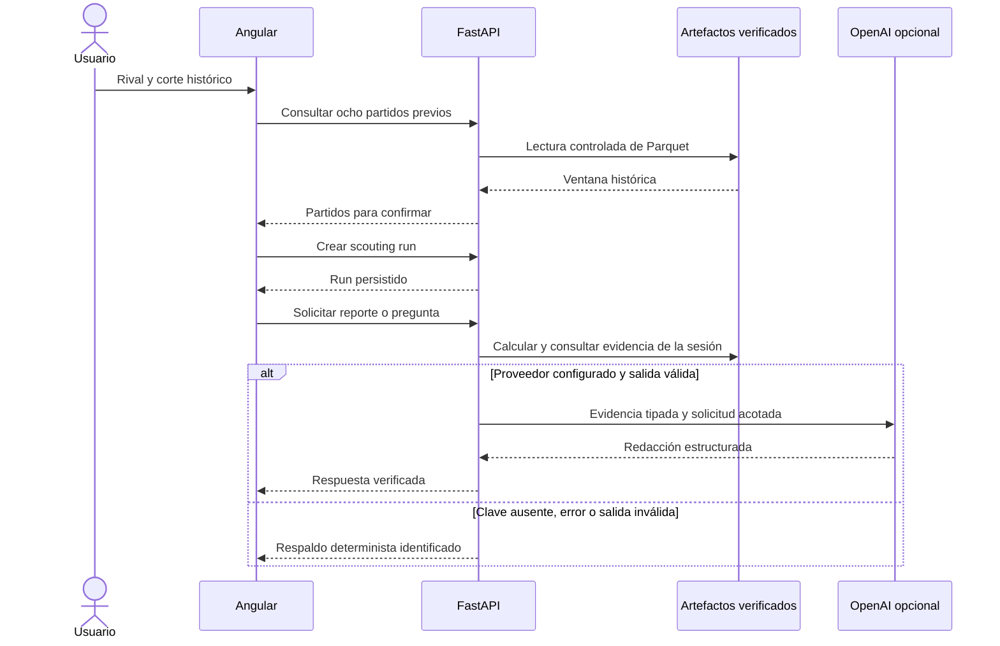

# Arquitectura implementada

## Principios

- Caso historico LaLiga 2015/16, nunca informacion actual.
- Raw inmutable y procesamiento pesado offline.
- Contratos, hashes y linaje entre etapas antes de consumir artefactos.
- Ocho partidos anteriores con corte temporal exclusivo.
- Calculos en Python; OpenAI solo consulta evidencia y redacta desde FastAPI.
- Toda cifra visible conserva referencia a partidos, eventos, reglas y runs.

## Flujo canonico 01-07

```text
StatsBomb Open Data / Google Drive
  -> data/raw
  -> 01_ingestion: contrato y hashes
  -> data/interim/02_clean: eventos normalizados + contexto previo
  -> data/interim/03_scr15: secuencias y auditorias
  -> data/processed/04_features: variables + K-Means descriptivo
  -> data/processed/05_modeling: evaluacion temporal y decisiones
  -> FastAPI + DuckDB controlado
       -> 06_reporte_tactico_llm: evidencia/OpenAI/fallback
       -> 07_herramientas_agente: tres tools read-only
  -> OpenAPI -> Angular standalone -> Vercel (pendiente)
```

La entrega académica explica el proceso por separado; `analytics` y `backend` son la implementación ejecutable canónica.

## Limites de etapas

`01_ingestion` registra raw, conteos y SHA-256. `02_clean` normaliza eventos y reconstruye contexto previo sin mirar eventos futuros. `03_scr15` aplica cuatro cierres por primer limite: 15 segundos, cambio de equipo en posesion, fin de periodo o nuevo corner. `04_features` construye historiales de ocho partidos, variables geometricas y K-Means fijo predesarrollo. `05_modeling` evalua cronologicamente y registra ganadores.

Decisiones de `05`: SCR-15 usa `league_reference`; `short_direct` y `corner_count` seleccionan `candidate`; `delivery_zone` queda `not_modelled`. K-Means no se usa como predictor.

## FastAPI y repositorio

FastAPI abre exclusivamente contratos y artefactos canonicos de `02_clean`, `03_scr15`, `04_features` y `05_modeling`. Antes de consultar, verifica versiones, run IDs, hashes y linaje. DuckDB abre Parquet por consulta mediante tablas conocidas y parametros validados; no hay SQL del LLM. La API no descarga StatsBomb ni entrena.

Cada scouting run fija rival, fecha de corte, ocho `match_id`, fingerprint y runs canonicos. Se persiste bajo `data/processed/runs`; un cambio de version invalida runs anteriores.

En modo opcional `CORNERSCOUT_STATELESS_RUNS=1`, el backend firma el contexto
en `X-CornerScout-Run` y el navegador lo conserva en `sessionStorage`. Cada
petición reconstruye la ventana desde los artefactos y comprueba ID y versión;
no escribe runs en disco. El secreto es backend-only. Este modo está preparado
para Vercel; su publicación pública sigue pendiente. Ver [guía](vercel.md).

Las tablas consultables incluyen `matches_clean`, `corners_engineered`,
`cluster_assignments`, `cluster_centers`, `objective_winners` y
`temporal_metrics`. El repositorio verifica también `03_scr15` y sus secuencias,
aunque no las exponga como una tabla de consulta pública.



## OpenAI y agente

`backend.openai` usa Responses API y Structured Outputs/Pydantic para el reporte. `OPENAI_API_KEY` y `OPENAI_MODEL` existen solo en backend. Una clave ausente, fallo de proveedor o salida no validable activa una plantilla determinista identificada.

`backend.agent` expone exactamente tres tools de solo lectura: `obtener_historial`, `obtener_perfil_corners` y `consultar_evidencia`. Estan limitadas a la sesion, validan argumentos y evidencia y aplican presupuestos de llamadas, tiempo, tokens y turnos. No acceden a web, raw, escritura, SQL libre o entrenamiento.

## Angular

Angular standalone consume OpenAPI mediante cliente tipado. La cancha SVG usa coordenadas StatsBomb 120 x 80. `tools/codegen` aisla la version TypeScript del generador. El navegador no contiene secretos ni llama directamente a OpenAI.

`frontend/scripts/build-config.mjs` publica el origen del backend en
`config.json`. En desarrollo las rutas relativas usan `proxy.conf.json`.
Los escudos y retratos se distribuyen en `public/media`, sin descargas en build.

## Despliegue

Docker se probó localmente con un motor real. La publicación externa y Vercel están pendientes. El contenedor recibe `02_clean`, `03_scr15`, `04_features`, `05_modeling` en lectura y `runs` con escritura; no usa artefactos demo antiguos. Ver `docs/deployment.md`.

## Puntos de entrada y mantenimiento

- `analytics/cli.py`: `ingest`, `build`, `train` y etapas individuales.
- `backend/main.py`: aplicación ASGI y endpoints `/api/v1`.
- `backend/repository.py`: contratos, hashes, linaje y DuckDB.
- `backend/service.py`: selección histórica e indicadores de la sesión.
- `backend/openai.py`, `backend/agent.py`: proveedor y validación de respuestas.
- `frontend/src/app/features/`: vistas; `core/`: API y utilidades compartidas.
- `scripts/export_openapi.py` y `tools/codegen`: contrato HTTP y cliente.

Instalación: [README](../README.md). Entradas y entidades:
[contratos](../contracts/README.md). Estado probado:
[validación](validation.md). Cierre de limpieza: [predeploy](predeploy.md).
