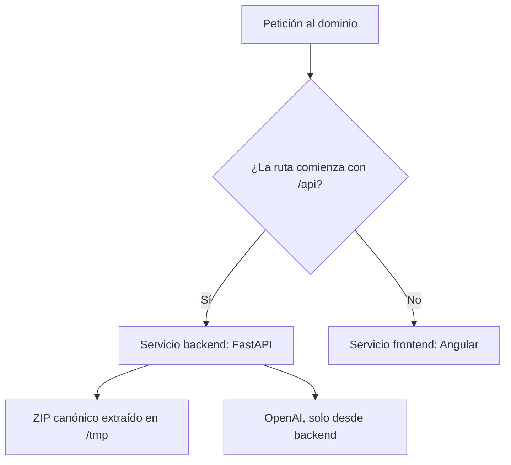

# Despliegue en Vercel

CornerScout está publicado en
[cornerscout-ten.vercel.app](https://cornerscout-ten.vercel.app/) mediante
Vercel Services. Angular y FastAPI se construyen como servicios independientes,
pero comparten dominio y configuración en el `vercel.json` de la raíz.

## Enrutamiento



Las reglas se evalúan en orden:

```json
{
  "rewrites": [
    { "source": "/api(/.*)?", "destination": { "service": "backend" } },
    { "source": "/(.*)", "destination": { "service": "frontend" } }
  ]
}
```

Angular usa `/api/v1` del mismo origen. No requiere una URL pública del backend
ni CORS para el tráfico normal de producción. Las rutas directas de la SPA
terminan en el servicio Angular.

## Datos durante el build y runtime

Los artefactos pesados no se guardan en Git. Para publicar una versión de datos:

```powershell
uv run --extra api python scripts/vercel_data.py package
```

El comando valida contratos, hashes y linaje de las etapas `02`–`05`, crea
`artifacts/vercel-canonical-data.zip` y muestra su SHA-256. El ZIP se publica
como asset inmutable de una release de GitHub, nunca como código o raw.

Durante el build, `scripts/vercel_data.py restore --bundle`:

1. Descarga el asset por HTTPS.
2. Comprueba el SHA-256 configurado.
3. Rechaza rutas fuera de las cuatro etapas permitidas.
4. Extrae en un directorio temporal y verifica contratos, archivos y linaje.
5. Conserva el ZIP verificado como `backend/canonical-data.zip` dentro de la función.

En cada instancia, FastAPI comprueba nuevamente el SHA-256 y extrae el ZIP una
vez en `/tmp`. DuckDB consulta esa copia; ninguna petición descarga StatsBomb,
entrena modelos o modifica artefactos científicos.

## Sesiones sin disco persistente

`CORNERSCOUT_STATELESS_RUNS=1` activa sesiones firmadas. Al crear un análisis,
FastAPI devuelve `X-CornerScout-Run` con rival, corte, run ID, versión y
fingerprint. Angular lo guarda en `sessionStorage` y lo envía en las solicitudes
del análisis.

Cada instancia reconstruye los ocho partidos y verifica firma, ventana y datos.
La sesión dura la pestaña; abrir otro navegador requiere crear un análisis nuevo.
Cambiar el secreto invalida las sesiones existentes. El encabezado no contiene
la clave de OpenAI ni permite modificar el alcance.

## Configuración del proyecto

Al importar el repositorio:

- Plan Hobby y rama `main`.
- Root Directory `./`.
- Preset Services definido por `vercel.json`.
- Sin overrides globales de install, build u output.

Variables de Production y, si se usan, Preview:

| Variable | Comportamiento |
|---|---|
| `CORNERSCOUT_SAME_ORIGIN=1` | Angular usa `/api/v1` en el dominio compartido. |
| `CORNERSCOUT_STATELESS_RUNS=1` | Evita depender de escritura persistente. |
| `CORNERSCOUT_SESSION_SECRET` | Secreto aleatorio de al menos 32 caracteres para firmar sesiones. |
| `CORNERSCOUT_DATA_ARCHIVE_URL` | URL HTTPS del asset de datos. |
| `CORNERSCOUT_DATA_ARCHIVE_SHA256` | SHA-256 exacto del ZIP publicado. |
| `OPENAI_API_KEY` | Secreto backend para reporte y agente. |
| `OPENAI_MODEL` | Modelo disponible con Responses API y salida estructurada. |

No definir `CORNERSCOUT_API_BASE_URL` ni `CORNERSCOUT_DATA_DIR` en esta ruta.
Nunca colocar claves o prompts en variables del frontend.

## Verificación después de desplegar

```powershell
uv run --extra api python scripts/smoke_deployment.py --base-url https://cornerscout-ten.vercel.app
```

El smoke comprueba `/health`, `/ready`, crea un análisis histórico y recorre las
seis secciones. `--assistant-mode deterministic` exige fallback sin proveedor;
`--assistant-mode openai` realiza llamadas reales y consume tokens.

En navegador conviene comprobar un análisis con Barcelona y corte `2016-03-01`,
recargar la pestaña, abrir una ruta interna directamente y recorrer Resumen,
Mapa, Patrones, Reporte, Calidad y Asistente. El caso siempre debe identificarse
como histórico, LaLiga 2015/16.

## Actualizaciones

- Cambio de frontend o backend: desplegar el commit y repetir health, ready y recorrido.
- Cambio compatible de datos: publicar un asset con tag nuevo y actualizar URL y SHA-256.
- Cambio incompatible de contratos: actualizar consumidores y crear análisis nuevos.
- Rotación del secreto: actualizar la variable; las sesiones anteriores dejarán de ser válidas.
- Cambio de modelo o clave: actualizar solo variables backend y comprobar ambos modos.

OpenAI se factura de manera independiente de Vercel. Sin clave o ante una salida
inválida, la aplicación permanece operativa mediante el respaldo determinista.
